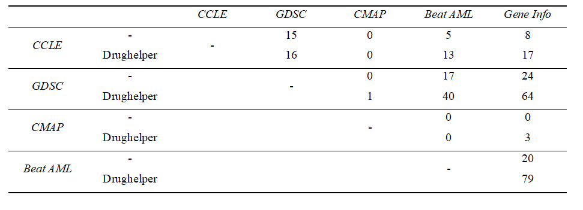

```{r setup, include = FALSE}
knitr::opts_chunk$set(
  collapse = TRUE,
  comment = "#>"
)
```

Drughelper is an R package to identify and correct some drug names of the user's interest in order to easily work with them. Drughelper is constantly updating its dataset (once a month) from Chembl's database.

## Installation

```{r, eval= FALSE}
install.packages("drughelper")

```

## Drughelper functionality

Drughelper has been created to be as interactive as possible, only one function is needed to get the main information of the input drugs. Also, a vector with the name or synonyms of required drugs is needed as an argument to the function:  

```{r, eval=TRUE}
library(drughelper)

vectorofdrugs <- c("Procaine", "Furazosin", "Embelin", "NotADrug")
```

## Download data manually

The dataset used is downloaded automatically when `checkDrugSynonym` is called, but can also be downloaded manually:

```{r, eval=FALSE}
downloadAbsentFile()

```

If data has already been downloaded, the function will not download anything.

## What does drughelper return

`checkDrugSynonym`  finds possible synonyms for each one of the drugs in the input and returns a dataframe with the best matched synonym for each drug. In the "matching" column, three types of matchings can occur: Exact match, if the drug matches any of the possible synonyms, or either it matches the name of the drug itself. If it does not appear exactly, an approximation may be found, in that case, an approximate matching is returned. Finally if a drug is not found "No match" will be returned. 

```{r, eval = FALSE}
checkDrugSynonym(vectorofdrugs)

```


## Case studies

Two case studies are explained, in which we compare the number of drug matches that appear in different studies both with and without the Drughelper function. The objective is to see if when comparing a drug name with all its synonyms, more matches appear or not.

### Case 1:

In this first approach, we have compared four different studies, three of them from the PharmacoGx project and the other one from the BeatAML functional genomic study.

PharmacoGx is an R package which has data from the cancer cell line encyclopedia (CCLE), the Genomics of Drug Sensitivity Cancer project (GDSC) and the connectivity map (CMAP) from the broad institute. They have 24, 139 and 5 unique drugs, respectively.

BeatAML is a program which contains different datasets on acute myeloid leukemia (AML). In this case the data used belongs to the drug response dataset, containing 122 unique drugs.


### Case 2:

Now a large dataset of 1996 drugs from DrugSniper is compared with the other ones. DrugSniper is a tool to exploit loss-of-function screens, created by the bioengineering department in Tecnun, University of Navarra. The data used is called 
"Gene Info" and contained data about both approved and investigational drugs targeted to protein inhibition retrieved publicly available in the ChEMBL and DrugBank online repositories.

### Results  

{width=100%}

Drughelper offers an improvement in drug name identification, comparing for example, GDSC and DrugSniper (Gene Info), without the function 24 drugs appear as part of both studies, but when Drughelper is applied, the number of drugs increase up to 64 drugs.
Other cross studies offer poor improvements, because e.g., CMAP database which does not provide significant results because it consists of only 5 entries
